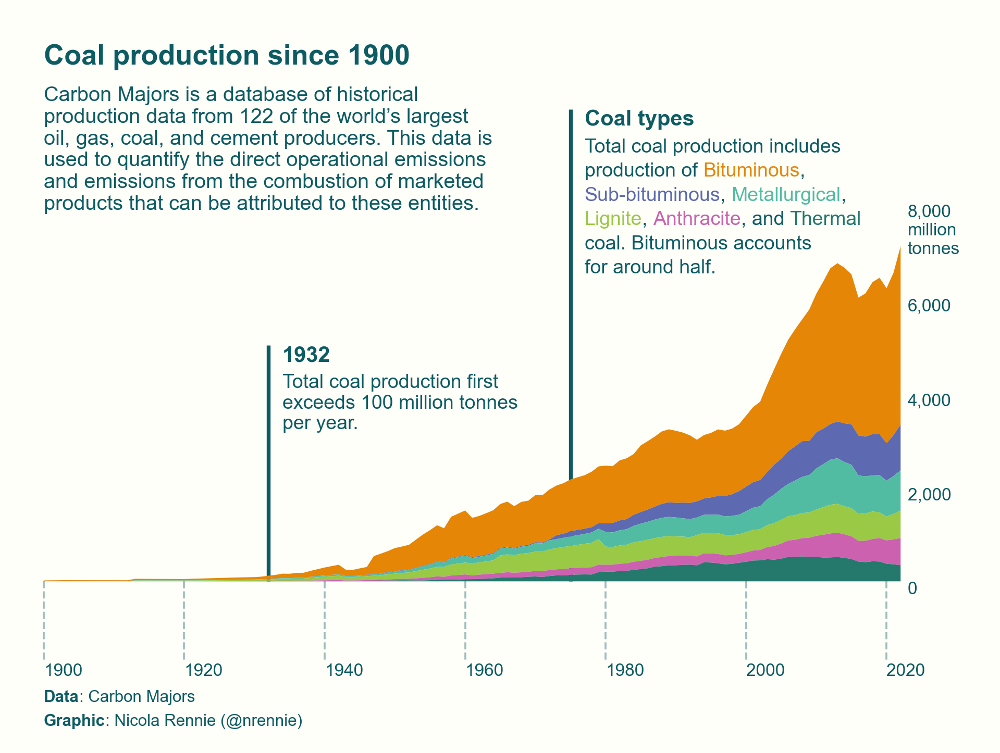

# 2024 `plotnine` contest

  

This repository contains code for my entry in the [2024 Plotnine Contest](https://posit.co/blog/announcing-the-2024-plotnine-contest/).

This entry for the `plotnine` contest was inspired by a visualisation I previously created using `{ggplot2}` in R for #TidyTuesday. You can see the original R version at [github.com/nrennie/tidytuesday/tree/main/2024/2024-05-21](https://github.com/nrennie/tidytuesday/tree/main/2024/2024-05-21).

The data is available from [github.com/rfordatascience/tidytuesday/blob/master/data/2024/2024-05-21/readme.md](https://github.com/rfordatascience/tidytuesday/blob/master/data/2024/2024-05-21/readme.md).
